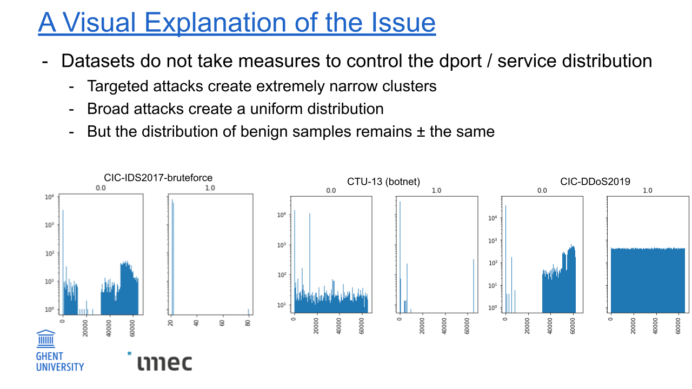

# Metadata features heavily bias ML-IDS models when included

Modern datasets in intrusion detection are designed to be evaluated by machine learning techniques and often contain metadata features which ought to be removed prior to training. Unfortunately many published articles include one or more metadata features in their ML models. The most commonly included metadata feature is destination port / service. The argument in favor is that it may contain useful information, by tying attacks to the services they uniquely target.

This repository contains the code and results which show that all available metadata features in ML-IDS datasets acts as shortcuts for the algorithms to heavily inflate their performance.

The included datasets:
NSL-KDD
ISCX-IDS2012
CIC collection: IDS2017, IDS2018, DoS2017, DDoS2019
CIC-IDS2017 improved version by Distrinet
UNSW-NB15
CIDDS-001 & CIDDS-002
CTU-13

Keywords: intrusion detection, machine learning, shortcut learning, dataset issues

## The problem visualized in one image:

## The solution

Any model that includes a metadata feature will learn a strong relationship during training which is only meaningful within the dataset, because the datasets' publishers don't actively control the distribution of the metadata feature in relation to benign and malicious traffic. Dataset authors can take countermeasures against this influence, but when applied properly, the feature becomes non-informative and could just as easily not have been part of the dataset in the first place. 

Consequently, this is the central recommendation in the article. Dataset users should not include destination port (or any other metadata feature) in their models and dataset authors should avoid giving their users the opportunity to use them.

